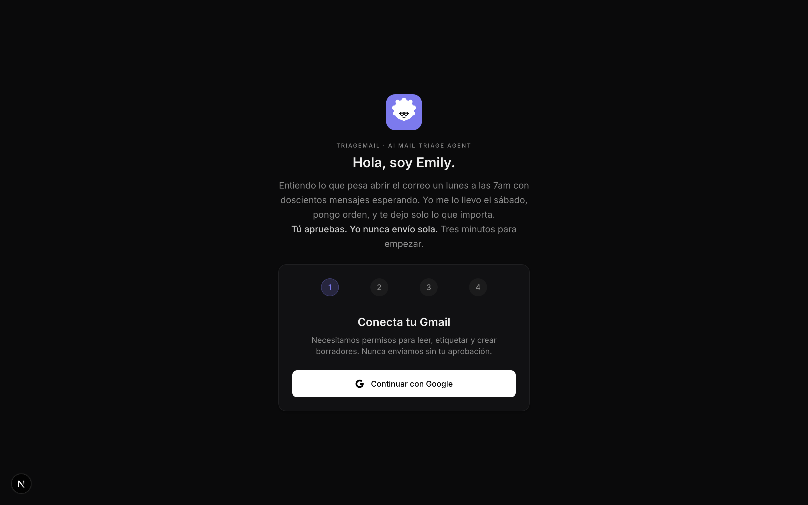
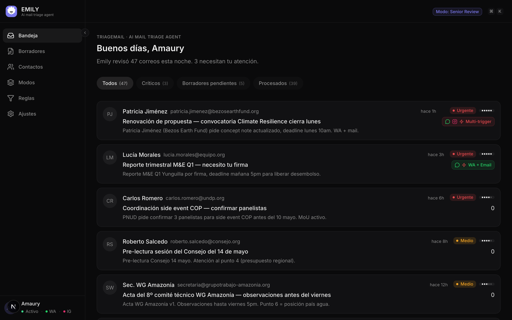
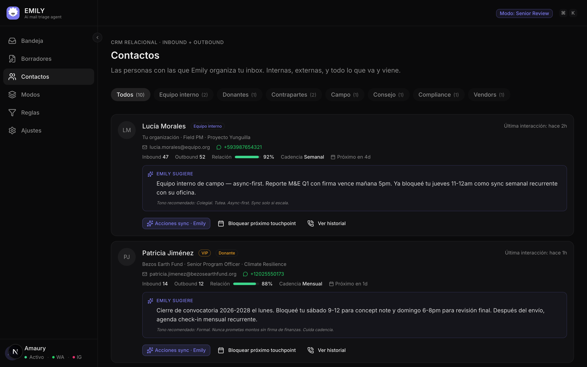
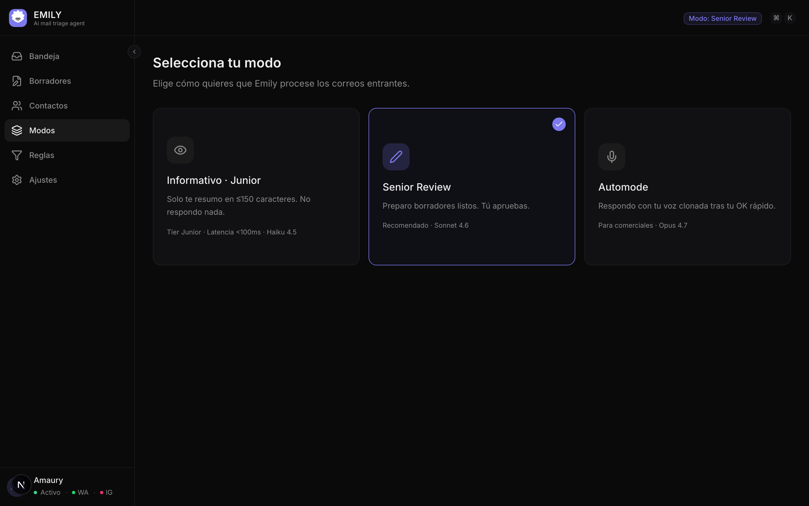
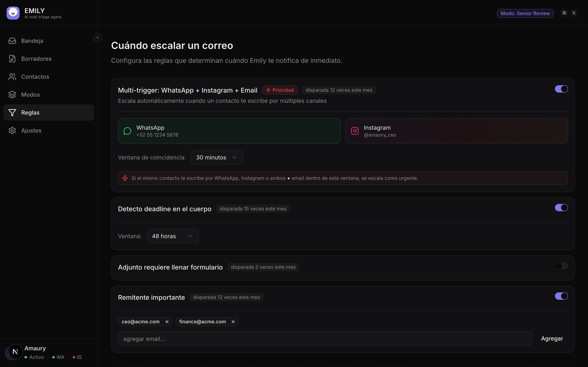
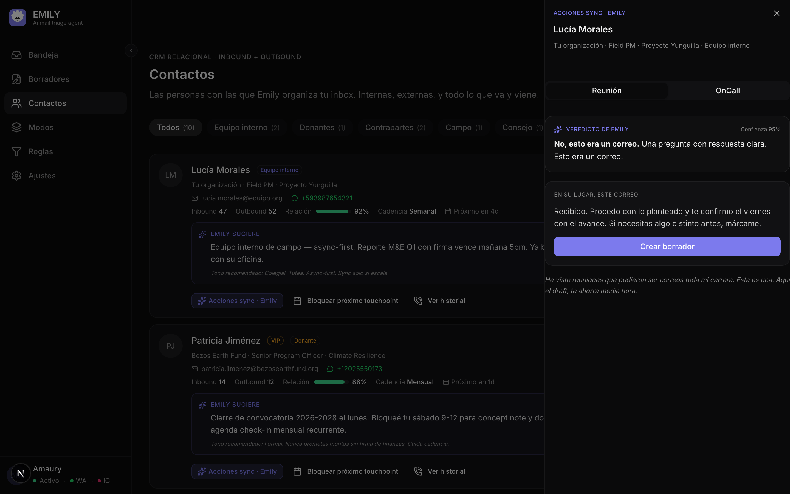
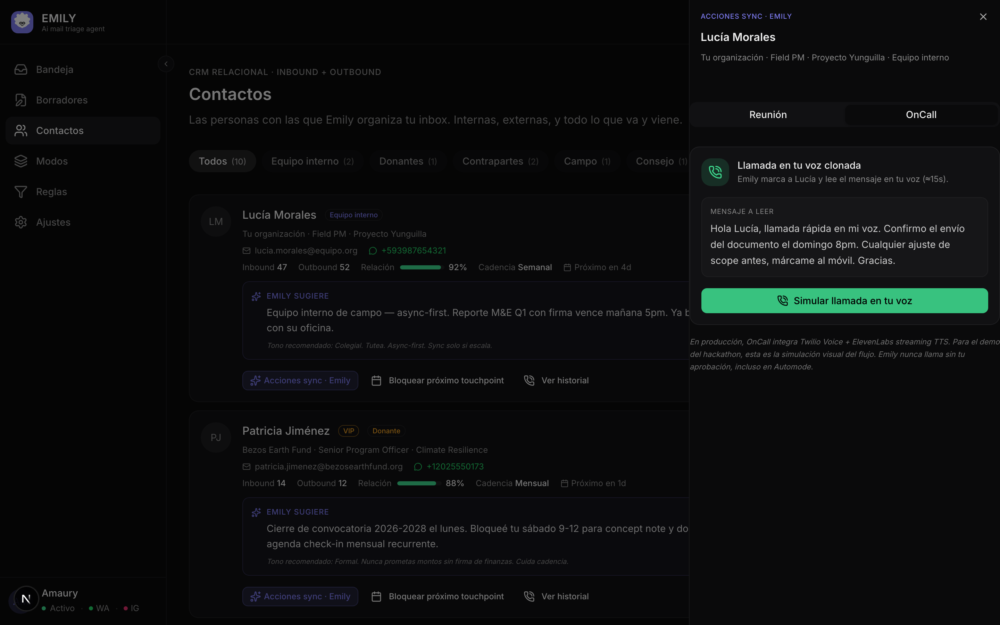

# TriageMail · Emily

> **AI Mail Triage Agent** para ejecutivos en cooperación internacional, fundaciones ambientales y redes inter-institucionales que quieren descansar el correo el fin de semana.

[](https://v0-triagemail-saas-o4b4dxq0l-amauryamed-1073s-projects.vercel.app)
[](https://community.vercel.com/hackathons/zero-to-agent)
[](https://v0.app)
[](https://x.com/search?q=%23ZeroToAgent)
[](https://github.com/amauryamed-svg/v0-triagemail-saas/stargazers)

---

## 🌅 Ya no abras el correo el sábado

> *"Entiendo lo que pesa abrir el correo un lunes a las 7am con doscientos mensajes esperando. Yo me lo llevo el sábado, pongo orden, y te dejo solo lo que importa. Tú apruebas. Yo nunca envío sola. Tres minutos para empezar."*
> — **Emily**, asistente dentro de TriageMail

TriageMail es una app construida con **v0** + **AI SDK 6** + **Claude (Haiku/Sonnet/Opus)** + **Supabase** + **ElevenLabs** que entrega tu fin de semana al fin de semana.

Una asistente llamada **Emily** lee tu inbox, prioriza con heurísticas Eisenhower + planificación de tiempo + agenda como escudo, redacta los borradores en **tu voz clonada** (no en la suya — el destinatario lee al usuario), y nunca envía sin tu aprobación.

> 🏆 Submission al **Vercel Zero to Agent Hackathon · Track 2 (v0 + MCPs)** — May 2026.
> **Si te suma la idea, dale ⭐ al repo.** Eso ayuda a que más equipos en cooperación encuentren a Emily.

---

## 📸 Las pantallas

### 1. Onboarding — la entrada empática



Hero con el avatar 2D animado de Emily (afro redondo, lentes, parpadeo cada 4.5s) + hook empático en su voz. Tres pasos: Gmail · Canales (WhatsApp + Instagram) · Voz clonada (15s) · Modo default.

### 2. Dashboard — la bandeja triada por Emily



8 correos del nicho real (Bezos Earth Fund, PNUD, KPMG, Min. Ambiente, WG Amazonía…) con badges de urgencia, importancia 1-5, **multi-trigger cross-platform** (mismo contacto en WhatsApp + Mail + Instagram), y borde lavanda en los que ya tienen draft pendiente.

### 3. Contactos · CRM Relacional Inbound + Outbound



10 contactos clasificados por tipo (donor / internal / partner / board / field / compliance / vendor / press), con organización, rol, contadores inbound/outbound, **fuerza de relación 0-100**, cadencia sugerida, próximo touchpoint, y una **sugerencia de Emily** específica para cada uno ("Cierre de convocatoria 2026-2028 el lunes. Bloqueé tu sábado 9-12 para concept note...").

### 4. Modos · Junior · Senior Review · Automode + Pro Review



Tres tiers + sub-configuración para Automode (Pro Review toggle + 3 canales: Email + nota de voz / OnCall / OnVoice). El pill del header se sincroniza en tiempo real (`Modo: X`).

### 5. Reglas · Cuándo escalar un correo



4 disparadores configurables del nicho: cross-platform push / deadline detectado / adjunto requiere firma / remitente VIP. Stat por cada regla de cuántas veces disparó este mes.

### 6. Acciones sync · Reunión



Emily evalúa **si vale más una reunión o un correo** combinando 7 reglas pro-meeting (decisión irreversible, multi-stakeholder, kickoff, deadline+ambigüedad…) y 7 anti-meeting (FYI, agradecimiento, internal async-first, **Parkinson trap**…). Si vale, propone hora exacta + agenda de 3 puntos + outcome esperado. Si no, te entrega el draft alternativo listo.

### 7. Acciones sync · OnCall (preview en tu voz clonada)



Simulación visual del flujo OnCall: Emily marca al contacto y lee el mensaje en **tu voz clonada** (15s). Waveform animado, contador, ping en vivo. En producción usa Twilio Voice + ElevenLabs streaming.

---

## 🎭 La persona Emily

Emily es **el icono de marca** de TriageMail. Fusiona tres referencias del universo de *The Devil Wears Prada* + Betty la fea:

| Capa | Referencia | Aporte |
|---|---|---|
| **Standards** | Emily Charlton | Precisión reloj suizo. Anticipatoria. Frase canónica: *"I don't understand why it's so difficult to confirm an appointment."* |
| **Resourcefulness** | Andy Sachs | La que consiguió el manuscrito inédito de Harry Potter para los gemelos en cuatro horas. Mentalidad de reportera del *Times*: implacable en buscar hasta encontrar. **Logra lo imposible un sábado.** |
| **Arco** | Betty la fea | Asistente subestimada que termina dirigiendo la empresa. Calidez, demuestra valor con resultados. |

**Dos voces, no las mezcles:**
- **Inbound (a ti)** — Emily te habla en briefings, microcopy, razonamiento. Tutea, ironía suave, sin emojis.
- **Outbound (a tus contactos)** — sale en **tu voz clonada** (ElevenLabs Instant Voice Clone, muestra de 15s). El destinatario te escucha a ti, no a Emily. Esa es la magia.

---

## 🧠 Las heurísticas de Emily

Cuatro motores de decisión, encadenados:

| Motor | Archivo | Ejemplos de reglas |
|---|---|---|
| **Eisenhower + cross-platform** | [`lib/emily-heuristics.ts`](lib/emily-heuristics.ts) | DO_FIRST cuando contacto escribe en 2+ canales; VIP recognition; newsletter filter. |
| **Tiempo + agenda** | [`lib/emily-time-planning.ts`](lib/emily-time-planning.ts) | Regla 1-3-5 del día; **Tres P** (Prioriza/Protege/Programa); cap de Parkinson por categoría; Pomodoro 25/5; 10% estratégico viernes 4-5pm; agenda como escudo. |
| **Tratamiento de contacto (CRM)** | [`lib/emily-contact-treatment.ts`](lib/emily-contact-treatment.ts) | Cooldown de donante; internal async-first; check-in trimestral con VIPs; señal débil de oficina de campo; compliance en bloque continuo. |
| **Reunión vs correo** | [`lib/emily-meeting-intelligence.ts`](lib/emily-meeting-intelligence.ts) | Sesgo anti-reunión por defecto. Pro-meeting solo si decisión irreversible / multi-stakeholder / sensible / kickoff / crisis. Detecta el "esto pudo ser un correo". |

---

## 🛠 Stack

- **Frontend**: Next.js 16 (App Router) · React 19 · Tailwind 4 · shadcn/ui · framer-motion · sonner
- **UI generada con [v0.app](https://v0.app)** — el track principal del hackathon
- **AI**: [Vercel AI SDK 6](https://ai-sdk.dev) + `@ai-sdk/anthropic` con Claude **Haiku 4.5** (Junior), **Sonnet 4.6** (Senior Review), **Opus 4.7** (Automode + Pro Review)
- **MCP server propio** en `/api/mcp` (cumple requisito Track 2)
- **DB**: [Supabase](https://supabase.com) Postgres + Storage (voice notes)
- **Voz**: [ElevenLabs](https://elevenlabs.io) Instant Voice Clone + TTS Multilingual v2
- **Email**: Gmail API vía `googleapis` + NextAuth 5 (Google OAuth)
- **Cron**: Vercel Cron `*/5 * * * *` para triage continuo
- **Multi-canal mockeado**: WhatsApp + Instagram via `POST /api/mock/{whatsapp,instagram}-push`

---

## 🚀 Llévatelo a tu organización

Si trabajas en cooperación internacional, fundación ambiental, o red inter-institucional y quieres a Emily en tu inbox:

```bash
git clone https://github.com/amauryamed-svg/v0-triagemail-saas.git
cd v0-triagemail-saas
pnpm install
cp .env.example .env.local
# llena: NEXT_PUBLIC_SUPABASE_URL, NEXT_PUBLIC_SUPABASE_ANON_KEY,
#        ANTHROPIC_API_KEY, ELEVENLABS_API_KEY, GOOGLE_CLIENT_ID/SECRET,
#        AUTH_SECRET (openssl rand -base64 32), CRON_SECRET
pnpm dev
```

El [`CLAUDE.md`](CLAUDE.md) tiene las reglas de colaboración + persona + arquitectura completa para que cualquier coding agent (Claude Code, Cursor, Codex) la entienda al abrir el repo.

### Conecta el MCP server a tu Claude Desktop

```json
{
  "mcpServers": {
    "triagemail-emily": {
      "url": "https://tu-deploy.vercel.app/api/mcp"
    }
  }
}
```

Tools expuestos: `triage_inbox`, `summarize_email`, `prioritize_email`, `list_pending_approvals`, `create_draft_for_thread`. Cualquier cliente AI puede triar el inbox del usuario invocándolos.

---

## 🤝 Cómo colaborar

Este proyecto está pensado para **seguir creciendo con la comunidad de cooperación internacional**. Si quieres contribuir:

- 🐛 **Abre un issue** con sugerencias de heurísticas para tu sector (humanitario, climate, salud global, derechos humanos, etc.)
- 🔌 **Manda un PR** con conectores nuevos: Slack, Teams, Linear, Notion, Asana, Salesforce Nonprofit Cloud
- 📚 **Comparte casos de uso reales** — qué reglas usas, qué automatizar, qué dejar manual
- 📞 **Probemos juntos** Emily en tu organización antes de que la abramos al público

**DM**: amauryamed@gmail.com · WhatsApp Crafters: [crafters.chat](https://crafters.chat)

---

## ⭐ Si te sirve la idea

> **Dale star al repo.** Cada estrella ayuda a que más equipos en cooperación, fundaciones y redes inter-institucionales encuentren a Emily — y que la próxima ronda de heurísticas sea co-creada con casos reales del sector.

[](https://github.com/amauryamed-svg/v0-triagemail-saas/stargazers)

Y si publicas algo del proyecto, usa el hashtag oficial:

**`#ZeroToAgent`** taggeando `@vercel` y `@v0byVercel`

---

## 📦 Continúa el desarrollo

Este repo está conectado a [v0](https://v0.app) — cada chat genera commits directo a `main` y deploya automático.

[Continúa en v0 →](https://v0.app/chat/projects/prj_mHtaQLtXeQ9eCrDxCrp1F9DZrxDq)

---

🤖 Built for [Vercel Zero to Agent Hackathon · Track 2 — v0 + MCPs](https://community.vercel.com/hackathons/zero-to-agent) — Mayo 2026
